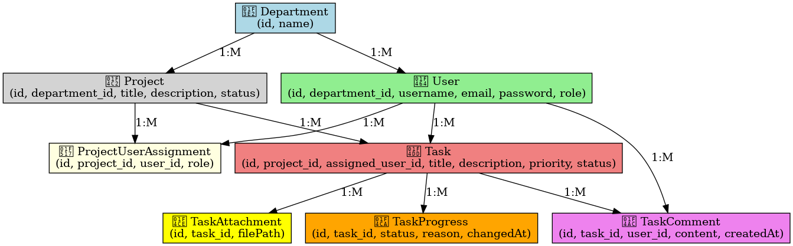

# 📝 Advanced Task Management

Bu proje, **Lorem Ipsum Corporation** firmasının eskiyen görev yönetim sisteminin yerine geliştirilen modern bir **görev yönetimi uygulamasıdır**.

Backend tarafında **Java 21 & Spring Boot 3**, veritabanı olarak **PostgreSQL**, konteynerleştirme için **Docker** kullanılmıştır. Proje, şu an için yalnızca backend tarafını içermektedir ve frontend daha sonra geliştirilecektir.

---

## 🚧 Projenin Amacı

Bu uygulama ile şu işlemler gerçekleştirilebilmektedir:

- Proje ve görev yönetimi
- Takım üyesi atama
- Görev ilerleme takibi
- Öncelik belirleme (kritik, yüksek, orta, düşük)
- Göreve dosya ekleme
- Göreve yorum yazabilme
- Yetki bazlı İşlem kısıtları (yetkisiz kullanıcılar bazı işlemleri yapamaz)

---

## 🚧 Geliştirme Durumu

> ⚠️ Bu proje **halen geliştirme aşamasındadır.**

🔧 Tamamlananlar:
- Backend mimarisi kuruldu
- Docker ile PostgreSQL servisi ayağa kaldırıldı
- Spring Security ile JWT tabanlı authentication yapısı sağlandı
- Swagger UI eklendi

💡 Devam Edenler:
- Unit test yazılması ve %80 kod kapsama hedefi

---

## 🧩 ER Diagramı

Aşağıda bu uygulamanın veritabanı ilişkilerini gösteren ER diyagramı yer almaktadır:

---

## 🌐 Swagger UI

API dokümanları ve test endpointleri için Swagger arayüzü kullanılmaktadır.

> 🔗 Swagger'a erişim: [https://advanced-task-management.onrender.com/swagger-ui/index.html](https://advanced-task-management.onrender.com/swagger-ui/index.html)

---

## ✨ Canlı Ortam (Render.com)

Backend uygulaması Docker image olarak build edilip Render.com'a otomatik olarak deploy edilmektedir.  Uygulamanın her zaman çalışır durumda olduğunu izlemek için UptimeRobot kullanılmıştır.  

> 🔧 Yayındaki proje linki: [https://advanced-task-management.onrender.com/auth/welcome](https://advanced-task-management.onrender.com/auth/welcome)

Uygulamanın frontend tarafı ileride geliştirilecektir. şu an için yalnızca backend endpointlerine ulaşılabilir.

---

## 🌐 Teknolojiler

- Java 21
- Spring Boot 3
- Spring Security + JWT
- Spring Data JPA (Hibernate)
- PostgreSQL
- Docker & Docker Compose
- GitHub Actions ile CI
- Swagger UI

---

